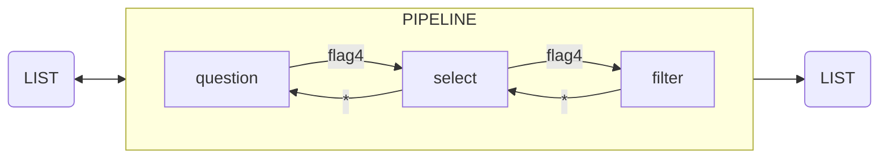

# Anki 2.1.54

Collection of Anki addons and scripts to parse sources, crop pdf papers, run OCR, provide a reading workflow, and customize templates for notes.
 
To run:
//for krop change dir to location of pdf//
```
    make dockeranki
    # in container 
    cd /home
    . ./runanki.sh  ## holding shift
```


<details>
    <summary>TODO</summary>

```

1. rebuild filter decks when tags/flag updated

2. krop pdf papers

3. filters : sched, www, ..     

4. video to slides to qa

5. multiple cards in 1 window 

6. src_field_merge

7. scan notebooks

8. OCR
    - addon: if image and no ocr then ocr it...
    - screenshot and ocr `Alt+\`
      ~/scripts/screenshot-main.sh
      ocr screenshot and copy into anki


10. www/
grep 'a class="tabLink"' tabs-may | sed -r 's/^.*href=(.*)/\1/'^C

    - linux browsers : 
        - chrome (save all to bookmark, then C+a copy)
            history trends unlimited
            TabCopy extension
            -- get all tab urls with annotation from Hypothesis -> json

        - firefox

    - osx : safari -> notes
    - iphone : safari -> notes

11. template for cards; clean up
- copy fields from notes with old templates to new templates
- copy screenshot to scrivener 500 img500.sh
```

</details>

---


### Use tags/flag4 to create a reading workflow



### Crop paragraphs from pdf-papers
* krop-pdfs/. ./krop.sh [paper] [yyyy-mon]


### Create notes from different reading material
Sources include japji, edx course website, MCAT books such as Barron, berkeley, examcrackers.
Parsed_Reading/

### Customized templates with field iterating, device image resizing
template_basic.txt

* update_card_id
put date in `dates` field
cid/1000 = unix time created -> format to dates

* css image
img {max-width: initial; max-height: initial; }

### OCR the screenshot to clipboard and add to note fields
- berkely-notes-link

- ocr script from screenshot/


### Scripts
1. **black screen issue**:
:TODO: Dockerfile
Docker is used to run the container; bash script is used to run anki 21.54.

```
    make dockeranki
    # in container 
    cd /home
    . ./runanki.sh  ## holding shift
```

2. filter:
    Filter new cards by week.
    Create a filtered deck with name.
    JS button to change tag.

added:30\*n //filter by month

<details>
    <summary>1month</summary>

```

for i in {1..10}; do echo -n ' 'added:$((${i}*30))' '-added:$(($((${i}-1))*30));date -d "${i} month ago" +' '%Y_%b' '__filter__; done
 added:30 -added:0 2023_Mar __filter__
 added:60 -added:30 2023_Feb __filter__
 added:90 -added:60 2023_Jan __filter__
 added:120 -added:90 2022_Dec __filter__
 added:150 -added:120 2022_Nov __filter__
 added:180 -added:150 2022_Oct __filter__
 added:210 -added:180 2022_Sep __filter__
 added:240 -added:210 2022_Aug __filter__
 added:270 -added:240 2022_Jul __filter__
 added:300 -added:270 2022_Jun __filter__

added:330 -added:300 2022_May __filter__
 added:360 -added:330 2022_Apr __filter__
 added:390 -added:360 2022_Mar __filter__
 added:420 -added:390 2022_Feb __filter__
 added:450 -added:420 2022_Jan __filter__
 added:480 -added:450 2021_Dec __filter__
 added:510 -added:480 2021_Nov __filter__
 added:540 -added:510 2021_Oct __filter__
 added:570 -added:540 2021_Sep __filter__
 added:600 -added:570 2021_Aug __filter__

added:630 -added:600 2021_Jul __filter__
 added:660 -added:630 2021_Jun __filter__
 added:690 -added:660 2021_May __filter__
 added:720 -added:690 2021_Apr __filter__
 added:750 -added:720 2021_Mar __filter__
 added:780 -added:750 2021_Feb __filter__
 added:810 -added:780 2021_Jan __filter__
 added:840 -added:810 2020_Dec __filter__
 added:870 -added:840 2020_Nov __filter__
 added:900 -added:870 2020_Oct __filter__

for i in {31..40}; do echo -n ' 'added:$(($((${i}*30))+15))' '-added:$(($(($((${i}-1))*30))+15));date -d "${i} month ago" +' '%Y_%b' '__filter__; done
 added:945 -added:894 2020_Sep __filter__
 added:975 -added:945 2020_Aug __filter__
 added:1005 -added:975 2020_Jul __filter__
 added:1035 -added:1005 2020_Jun __filter__
 added:1065 -added:1035 2020_May __filter__
 added:1095 -added:1065 2020_Apr __filter__
 added:1125 -added:1095 2020_Mar __filter__
 added:1155 -added:1125 2020_Feb __filter__
 added:1185 -added:1155 2020_Jan __filter__
 added:1215 -added:1185 2019_Dec __filter__

 for i in {41..50}; do echo -n ' 'added:$(($((${i}*30))+15))' '-added:$(($(($((${i}-1))*30))+15));date -d "${i} month ago" +' '%Y_%b' '__filter__; done
 added:1245 -added:1215 2019_Nov __filter__
 added:1275 -added:1245 2019_Oct __filter__
 added:1305 -added:1275 2019_Sep __filter__
 added:1335 -added:1305 2019_Aug __filter__
 added:1365 -added:1335 2019_Jul __filter__
 added:1395 -added:1365 2019_Jun __filter__
 added:1425 -added:1395 2019_May __filter__
 added:1455 -added:1425 2019_Apr __filter__
 added:1485 -added:1455 2019_Mar __filter__
 added:1515 -added:1485 2019_Feb __filter__

for i in {71..80}; do echo -n ' 'added:$(($((${i}*30))+15))' '-added:$(($(($((${i}-1))*30))+15));date -d "${i} month ago" +' '%Y_%b' '__filter__; done
 added:2145 -added:2115 2017_May __filter__
 added:2175 -added:2145 2017_Apr __filter__
 added:2205 -added:2175 2017_Mar __filter__
 added:2235 -added:2205 2017_Feb __filter__
 added:2265 -added:2235 2017_Jan __filter__
 added:2295 -added:2265 2016_Dec __filter__
 added:2325 -added:2295 2016_Nov __filter__
 added:2355 -added:2325 2016_Oct __filter__
 added:2385 -added:2355 2016_Sep __filter__
 added:2415 -added:2385 2016_Aug __filter__


for i in {1..10}; do echo -n ' 'added:$((${i}*30))' '-added:$(($((${i}-1))*30));date -d "${i} month ago" +' 'tag:%Y_%b' 'tag:__filter__; done

##for i in {1..10}; do echo -n ' 'added:$((${i}*30))' '-added:$(($((${i}-1))*30));date -d "${i} month ago" +' '%Y_%m%b;date -d "${i} month ago" +' 'tag:%Y_%b' 'tag:__filter__; done

for i in {1..10}; do echo ' 'added:$((${i}*30))' '-added:$(($((${i}-1))*30));echo -ne `date -d "${i} month ago" +' '%Y_%m%b`;date -d "${i} month ago" +' 'tag:%Y_%b' 'tag:__filter__; done


added:1230 -added:1200
2019_11Nov tag:2019_Nov tag:__filter__
 added:1260 -added:1230
2019_10Oct tag:2019_Oct tag:__filter__
 added:1290 -added:1260
2019_09Sep tag:2019_Sep tag:__filter__
 added:1320 -added:1290
2019_08Aug tag:2019_Aug tag:__filter__
 added:1350 -added:1320
2019_07Jul tag:2019_Jul tag:__filter__
 added:1380 -added:1350
2019_06Jun tag:2019_Jun tag:__filter__
 added:1410 -added:1380
2019_05May tag:2019_May tag:__filter__
 added:1440 -added:1410
2019_04Apr tag:2019_Apr tag:__filter__
 added:1470 -added:1440
2019_03Mar tag:2019_Mar tag:__filter__
 added:1500 -added:1470
2019_02Feb tag:2019_Feb tag:__filter__

 in {41..50}; do echo ' 'added:$((${i}*30))' '-added:$(($((${i}-1))*30));echo -ne `date -d "${i} month ago" +' '%Y_%m%b`;date -d "${i} month ago" +' 'tag:%Y_%b' 'tag:__filter__; done
 added:1230 -added:1200
2019_11Nov tag:2019_Nov tag:__filter__
 added:1260 -added:1230
2019_10Oct tag:2019_Oct tag:__filter__
 added:1290 -added:1260
2019_09Sep tag:2019_Sep tag:__filter__
 added:1320 -added:1290
2019_08Aug tag:2019_Aug tag:__filter__
 added:1350 -added:1320
2019_07Jul tag:2019_Jul tag:__filter__
 added:1380 -added:1350
2019_06Jun tag:2019_Jun tag:__filter__
 added:1410 -added:1380
2019_05May tag:2019_May tag:__filter__
 added:1440 -added:1410
2019_04Apr tag:2019_Apr tag:__filter__
 added:1470 -added:1440
2019_03Mar tag:2019_Mar tag:__filter__
 added:1500 -added:1470
2019_02Feb tag:2019_Feb tag:__filter__


** up to Jan 2017 **

```

</details>

--------------------------------------------------------------------------------

### Anki
* select all `C+Alt+A`
* add tag `C+Shift+A`
* `C-S-X` view html in editor
* `ctrl + Shift + ;` debug console
* tags are added at note-level : all siblings tagged as well
if just want that card use **flag**
* [display tags on the card](https://forums.ankiweb.net/t/display-tags-on-the-card/16577/2)
* ease settings:
* advanced browser: 
review multiple at once
* backups `/home/Your_Username/.local/share/Anki2/Your_ProfileName/backupsi`
* remote debugging console `http://127.0.0.1:8080`
* tags:
* (tag1 and tag2) or (tag..)
* `is:new` `rated:1`
* addons `/.local/share/Anki2/addons21`
* [tag documentation](https://docs.ankiweb.net/searching.html)

### Vscode
* `  code --ignore-certificate-errors`
* `S-A-f2`   find links
* `C+S+V`    preview
* `C+K V`    preview md dual
* `or C+S+P` Markdown dual
* `C-A-V`    vim mode toggle
* `C-S-P`   commands
* `C-S-X`   extensions

### Vim
* `:term make readme`

### Git
* `git push -u origin main` from local machine to github
* `git pull -u origin main` from github to local
* `git stash --include-untracked` remove all local changes including untracked
* `git stash drop` drop stash
* `git add -A`  deal with deleted files, etc
* `git remote add origin [url]` connect local to remote(github) repo that create
* `git branch -M main` set master as main branch
* `git diff br1:file br2:file` see file diff between branches

```
_start_working:
ls => gives the files of where you are at in git
git branch -v => //master(1st one you ever started with)?/
                 //current branch will be *
git log --decorate => shows the curr branch and its commits
git checkout 'branch-name' //switch branches
git checkout 'commit-file' //checkout commit

_merge_:
check out branch you wish to merge into, then
git merge branch-to-be-merged
CONFLICT:
resolve by hand;
file above ====== is head(MASTER) | file below is
to-be-merged ;
then git add //to stage
git mergetool
```

#### aliases 

```
.git/config 
[user] 
    email = []
    name = []
 
[alias] 
    ci = commit 
    st = status 
    co = checkout 
    oneline = log --pretty=oneline 
    br = branch 
    la = log --pretty='format:%ad %h (%an): %s' --date=short 
    gr = log --pretty='format:%h %s' --graph 
    ls = ls-tree -r HEAD --name-only 
    todo  = grep --heading --break --ignore-case -e 'TODO: *' 
    fixme = grep --heading --break --ignore-case -e 'FIX: *' -e 'FIXME: *' 
 
~/.bashrc 
alias dexec="docker exec -it rockr /bin/bash" 
alias dps="docker ps" 
alias dimg="docker images | less"
```

#### docker

```
// from remote to local  
ssh target_server 'docker save image:latest | bzip2' | pv | bunzip2 | docker load 
ssh linode 'docker save rocker/tidyverse:v1h | bzip2' | pv | bunzip2 | docker load
```
